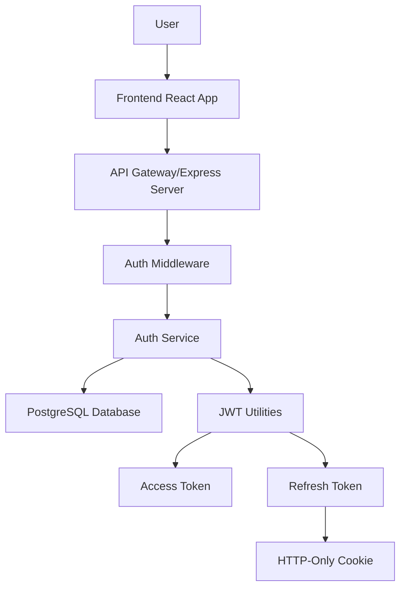
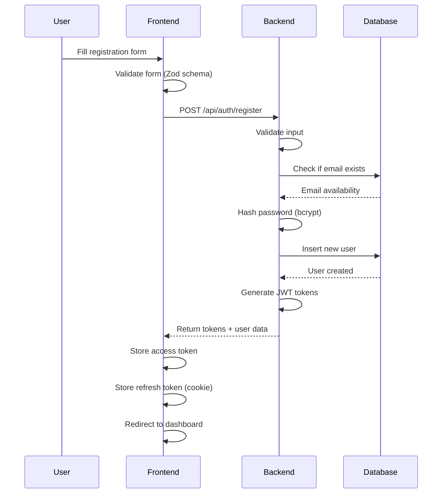
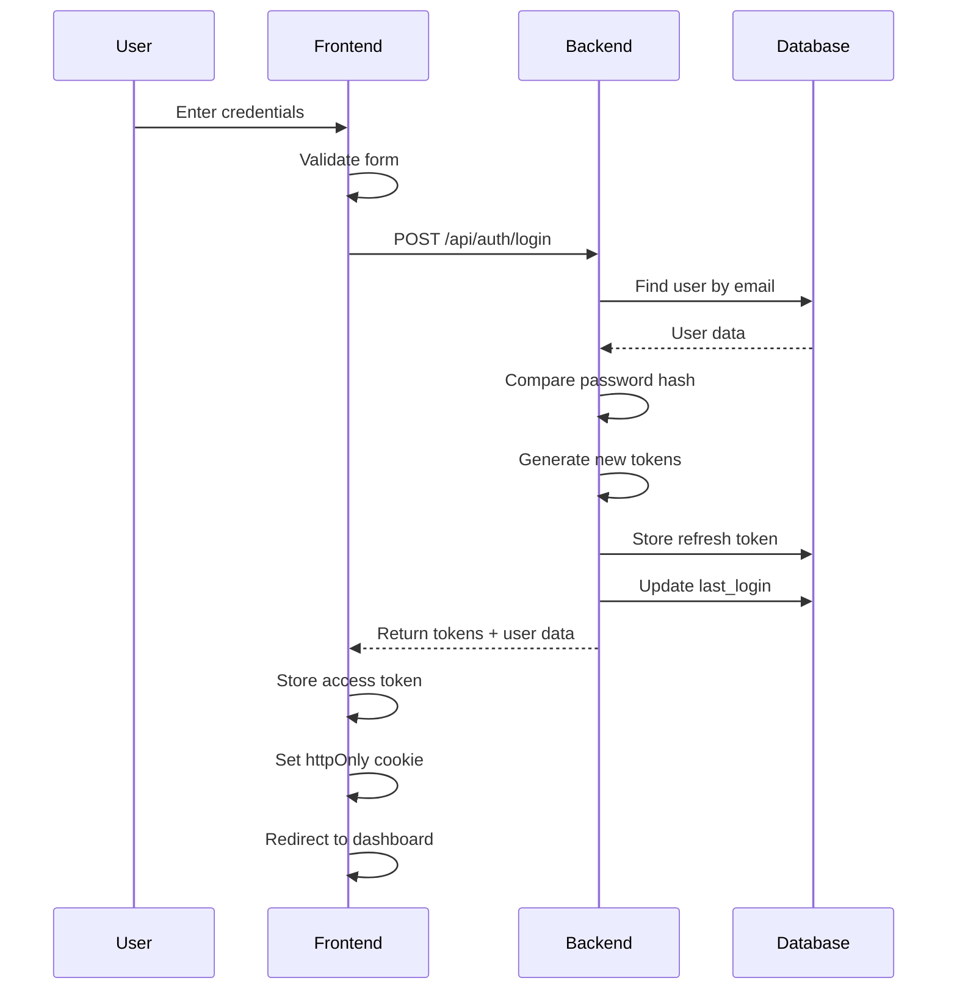
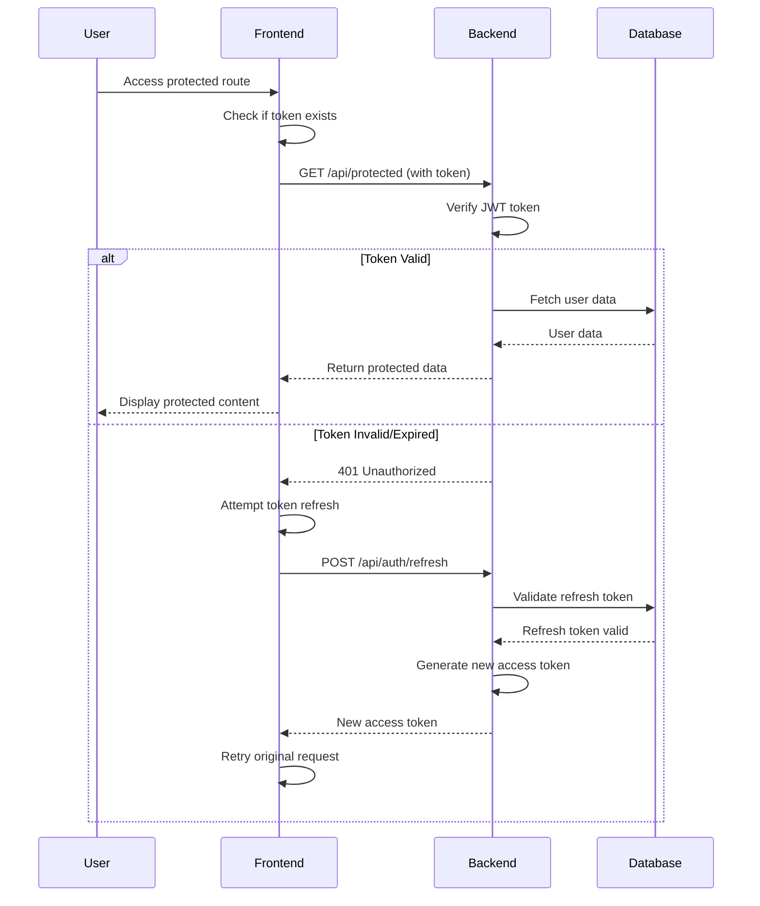
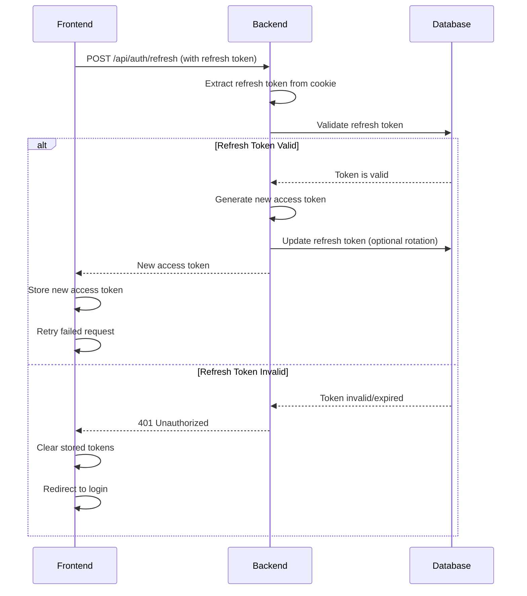
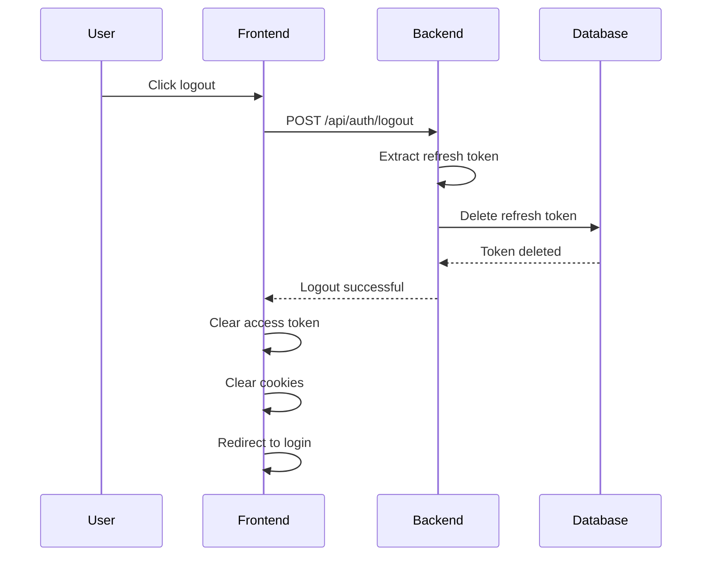

# SkillWise - Personal Learning Management System


## 📋 Table of Contents
- [Overview](#overview)
- [Features](#features)
- [Tech Stack](#tech-stack)
- [Project Structure](#project-structure)
- [Authentication Flow](#authentication-flow)
- [Getting Started](#getting-started)
- [API Documentation](#api-documentation)
- [Testing](#testing)
- [Contributing](#contributing)

## 🎯 Overview

SkillWise is a modern, full-stack personal learning management system designed to help users track their learning progress, set goals, and manage their educational journey. Built with React, Node.js, and PostgreSQL, it provides a secure and intuitive platform for personal skill development.

## ✨ Features

### 🔐 Authentication & Security
- **Secure User Registration** with email validation
- **JWT-based Authentication** with access and refresh tokens
- **Password Hashing** using bcrypt
- **Session Management** with automatic token refresh
- **Protected Routes** and middleware
- **Role-based Access Control**

### 📊 Dashboard & Learning Management
- **Personal Dashboard** with learning overview
- **Goal Setting & Tracking**
- **Progress Visualization**
- **Learning Challenges**
- **User Profile Management**

### 🛠️ Developer Experience
- **Docker Containerization** for easy deployment
- **Comprehensive Testing Suite**
- **API Documentation**
- **Error Handling & Logging**
- **Development Environment Setup**

## 🚀 Tech Stack

### Frontend
- **React 18** - Modern UI library
- **React Router DOM** - Client-side routing
- **React Hook Form** - Form management
- **Zod** - Schema validation
- **Axios** - HTTP client
- **CSS3** - Styling

### Backend
- **Node.js** - Runtime environment
- **Express.js** - Web framework
- **PostgreSQL** - Primary database
- **JWT** - Authentication tokens
- **bcrypt** - Password hashing
- **Helmet** - Security middleware
- **CORS** - Cross-origin resource sharing

### DevOps & Tools
- **Docker & Docker Compose** - Containerization
- **Jest & Supertest** - Testing framework
- **ESLint** - Code linting
- **Nodemon** - Development server

## 📁 Project Structure

```
SkillWise/
├── backend/                 # Node.js backend application
│   ├── src/
│   │   ├── controllers/     # Route controllers
│   │   ├── middleware/      # Custom middleware
│   │   ├── routes/          # API routes
│   │   ├── services/        # Business logic
│   │   ├── utils/           # Utility functions
│   │   ├── database/        # Database configuration
│   │   └── app.js           # Express app setup
│   ├── tests/               # Backend tests
│   └── package.json
├── frontend/                # React frontend application
│   ├── src/
│   │   ├── components/      # React components
│   │   ├── pages/           # Page components
│   │   ├── services/        # API services
│   │   ├── utils/           # Utility functions
│   │   └── App.jsx          # Main app component
│   ├── public/              # Static files
│   └── package.json
├── database/                # Database migrations & seeds
├── docker-compose.yml       # Multi-container setup
├── .env.example            # Environment variables template
└── README.md               # This file
```

## 🔐 Authentication Flow

### High-Level Authentication Architecture



### Detailed Authentication Flow

#### 1. User Registration Process


#### 2. User Login Process


#### 3. Protected Route Access


#### 4. Token Refresh Flow


#### 5. Logout Process


### Security Features

#### 🛡️ Token Security
- **Access Tokens**: Short-lived (15 minutes), stored in memory
- **Refresh Tokens**: Long-lived (7 days), stored in httpOnly cookies
- **Token Rotation**: Refresh tokens are rotated on each use
- **Secure Storage**: Sensitive tokens never stored in localStorage

#### 🔒 Password Security
- **bcrypt Hashing**: Passwords hashed with salt rounds
- **Password Validation**: Strong password requirements enforced
- **No Plain Text**: Passwords never stored in plain text

#### 🚫 Attack Prevention
- **CSRF Protection**: httpOnly cookies prevent CSRF attacks
- **XSS Protection**: Helmet.js security headers
- **Rate Limiting**: Prevent brute force attacks
- **Input Validation**: Zod schemas validate all inputs

## 🚀 Getting Started

### Prerequisites
- Node.js 18+
- Docker & Docker Compose
- PostgreSQL (if running locally)

### Quick Start with Docker

1. **Clone the repository**
```bash
git clone <repository-url>
cd CSC425-SkillWise
```

2. **Set up environment variables**
```bash
cp .env.example .env
# Edit .env with your configuration
```

3. **Start the application**
```bash
docker-compose up --build
```

4. **Access the application**
- Frontend: http://localhost:3000
- Backend API: http://localhost:3001
- Database: localhost:5433

### Local Development Setup

1. **Install dependencies**
```bash
# Backend
cd backend
npm install

# Frontend
cd ../frontend
npm install
```

2. **Set up database**
```bash
# Create PostgreSQL database
createdb skillwise_dev

# Run migrations
cd backend
npm run migrate
```

3. **Start development servers**
```bash
# Terminal 1: Backend
cd backend
npm run dev

# Terminal 2: Frontend
cd frontend
npm start
```

## 📚 API Documentation

### Authentication Endpoints

#### Register User
```http
POST /api/auth/register
Content-Type: application/json

{
  "firstName": "John",
  "lastName": "Doe",
  "email": "john@example.com",
  "password": "SecurePassword123"
}
```

#### Login User
```http
POST /api/auth/login
Content-Type: application/json

{
  "email": "john@example.com",
  "password": "SecurePassword123"
}
```

#### Get User Profile
```http
GET /api/auth/profile
Authorization: Bearer <access_token>
```

#### Refresh Token
```http
POST /api/auth/refresh
Cookie: refreshToken=<refresh_token>
```

#### Logout
```http
POST /api/auth/logout
Cookie: refreshToken=<refresh_token>
```

### Response Formats

#### Success Response
```json
{
  "success": true,
  "data": {
    "user": {
      "id": 1,
      "email": "john@example.com",
      "firstName": "John",
      "lastName": "Doe"
    },
    "accessToken": "eyJhbGciOiJIUzI1NiIs..."
  },
  "message": "Login successful"
}
```

#### Error Response
```json
{
  "success": false,
  "error": {
    "message": "Invalid credentials",
    "code": "INVALID_CREDENTIALS",
    "status": 401
  }
}
```

## 🧪 Testing

### Run All Tests
```bash
# Backend tests
cd backend
npm test

# Frontend tests
cd frontend
npm test

# Run with coverage
npm run test:coverage
```

### Test Categories
- **Unit Tests**: Individual function testing
- **Integration Tests**: API endpoint testing
- **Component Tests**: React component testing
- **E2E Tests**: Full application flow testing

## 📊 Database Schema

### Users Table
```sql
CREATE TABLE users (
  id SERIAL PRIMARY KEY,
  email VARCHAR(255) UNIQUE NOT NULL,
  password_hash VARCHAR(255) NOT NULL,
  first_name VARCHAR(100) NOT NULL,
  last_name VARCHAR(100) NOT NULL,
  role VARCHAR(50) DEFAULT 'user',
  is_active BOOLEAN DEFAULT true,
  created_at TIMESTAMP DEFAULT CURRENT_TIMESTAMP,
  updated_at TIMESTAMP DEFAULT CURRENT_TIMESTAMP,
  last_login TIMESTAMP
);
```

### Refresh Tokens Table
```sql
CREATE TABLE refresh_tokens (
  id SERIAL PRIMARY KEY,
  token VARCHAR(255) UNIQUE NOT NULL,
  user_id INTEGER REFERENCES users(id) ON DELETE CASCADE,
  expires_at TIMESTAMP NOT NULL,
  created_at TIMESTAMP DEFAULT CURRENT_TIMESTAMP
);
```

## 🔧 Configuration

### Environment Variables
```env
# Database
DB_HOST=localhost
DB_PORT=5432
DB_NAME=skillwise_dev
DB_USER=skillwise_user
DB_PASSWORD=your_password

# JWT
JWT_SECRET=your-super-secret-jwt-key
JWT_REFRESH_SECRET=your-refresh-secret-key
JWT_EXPIRES_IN=15m
JWT_REFRESH_EXPIRES_IN=7d

# Server
PORT=3001
NODE_ENV=development
CLIENT_URL=http://localhost:3000
```

## 🤝 Contributing

1. Fork the repository
2. Create a feature branch (`git checkout -b feature/amazing-feature`)
3. Commit your changes (`git commit -m 'Add amazing feature'`)
4. Push to the branch (`git push origin feature/amazing-feature`)
5. Open a Pull Request

### Development Guidelines
- Write tests for new features
- Follow ESLint configuration
- Update documentation for API changes
- Use conventional commit messages

## 📄 License

This project is licensed under the MIT License - see the [LICENSE](LICENSE) file for details.

## 🙋‍♂️ Support

For support, email support@skillwise.com or create an issue in the repository.

---

**Built with ❤️ by the SkillWise Team**