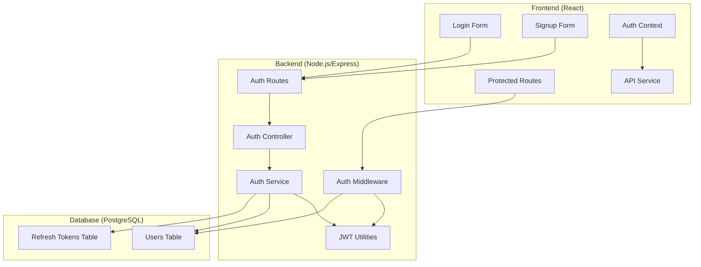
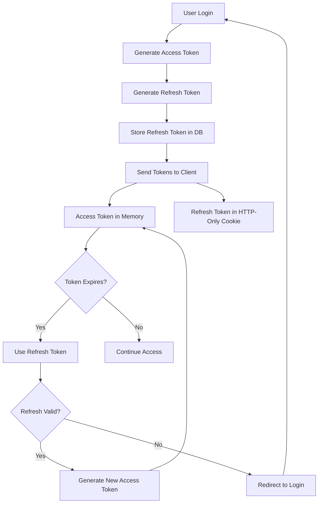
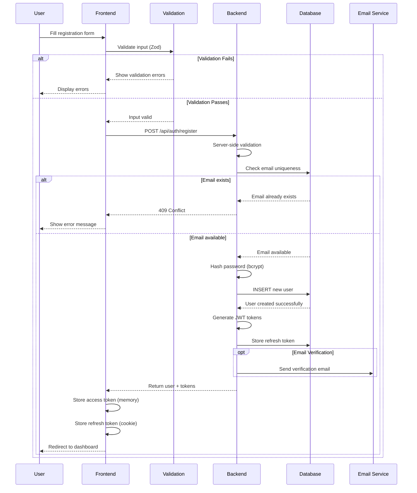
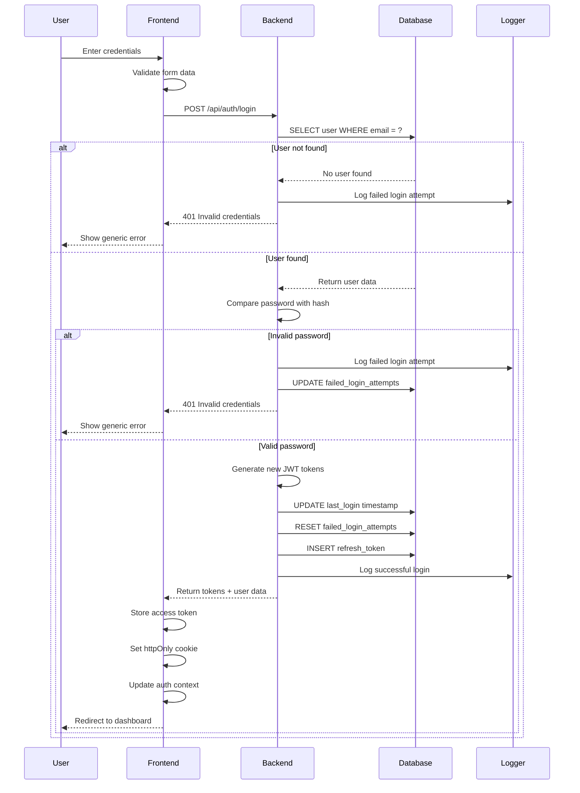
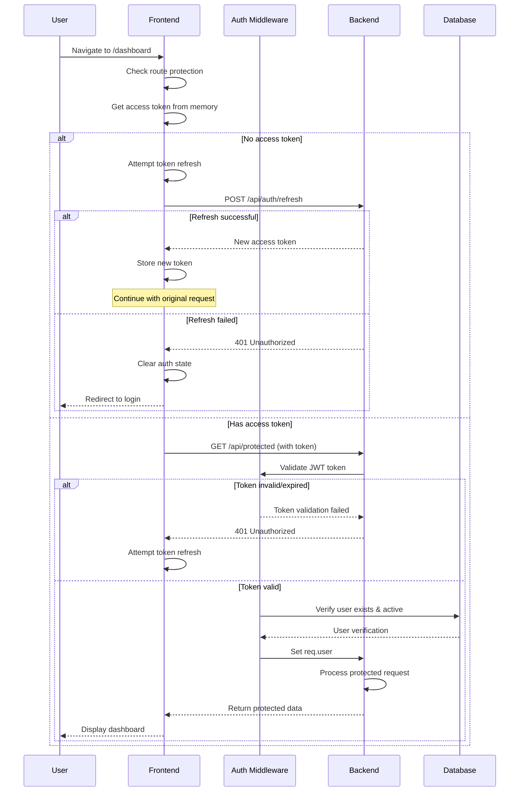
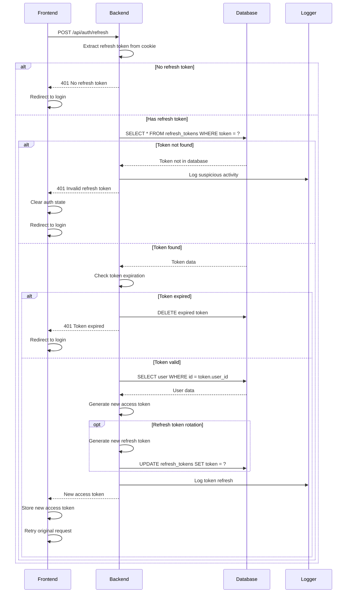
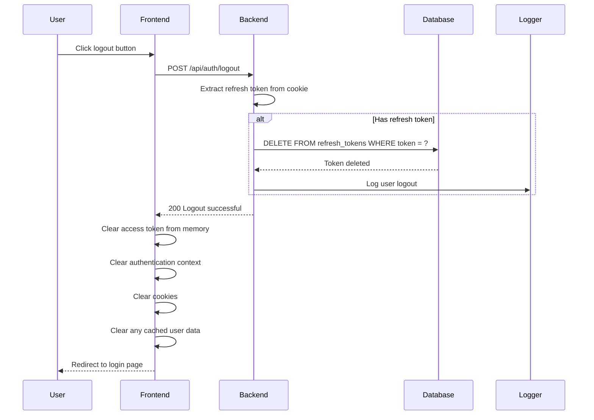

# SkillWise Authentication Flow Documentation

## 🔐 Complete Authentication Architecture

This document provides a comprehensive guide to the authentication system implemented in SkillWise, including security measures, token management, and user flow diagrams.

## Table of Contents
- [Architecture Overview](#architecture-overview)
- [Security Model](#security-model)
- [Token Management](#token-management)
- [User Authentication Flows](#user-authentication-flows)
- [Error Handling](#error-handling)
- [Security Best Practices](#security-best-practices)

## Architecture Overview

### System Components



### Layer Responsibilities

1. **Frontend Layer**
   - User interface for authentication
   - Token storage and management
   - Route protection
   - Automatic token refresh

2. **Backend Layer**
   - Authentication logic
   - Token generation/validation
   - Password hashing
   - Session management

3. **Database Layer**
   - User data persistence
   - Refresh token storage
   - User session tracking

## Security Model

### Authentication Strategy
- **JWT (JSON Web Tokens)** for stateless authentication
- **Dual Token System**: Access + Refresh tokens
- **HTTP-Only Cookies** for refresh token storage
- **Memory Storage** for access tokens

### Security Measures

#### 🛡️ Token Security
```javascript
// Access Token Configuration
{
  algorithm: 'HS256',
  expiresIn: '15m',        // Short-lived
  storage: 'memory'        // Not in localStorage
}

// Refresh Token Configuration  
{
  algorithm: 'HS256',
  expiresIn: '7d',         // Long-lived
  storage: 'httpOnly cookie', // Secure, not accessible via JS
  sameSite: 'strict',      // CSRF protection
  secure: true             // HTTPS only in production
}
```

#### 🔒 Password Security
```javascript
// Password Hashing
const saltRounds = 12;
const hashedPassword = await bcrypt.hash(password, saltRounds);

// Password Validation Requirements
const passwordSchema = z.string()
  .min(8, 'Password must be at least 8 characters')
  .regex(/[A-Z]/, 'Password must contain uppercase letter')
  .regex(/[a-z]/, 'Password must contain lowercase letter')
  .regex(/\d/, 'Password must contain a number');
```

## Token Management

### Token Lifecycle



### Token Refresh Implementation

#### Frontend Token Refresh
```javascript
// Automatic token refresh on API calls
const apiClient = axios.create({
  baseURL: process.env.REACT_APP_API_URL
});

// Request interceptor to add token
apiClient.interceptors.request.use((config) => {
  const token = getAccessToken();
  if (token) {
    config.headers.Authorization = `Bearer ${token}`;
  }
  return config;
});

// Response interceptor to handle token refresh
apiClient.interceptors.response.use(
  (response) => response,
  async (error) => {
    const originalRequest = error.config;
    
    if (error.response?.status === 401 && !originalRequest._retry) {
      originalRequest._retry = true;
      
      try {
        const newToken = await refreshAccessToken();
        setAccessToken(newToken);
        originalRequest.headers.Authorization = `Bearer ${newToken}`;
        return apiClient(originalRequest);
      } catch (refreshError) {
        logout();
        throw refreshError;
      }
    }
    
    return Promise.reject(error);
  }
);
```

#### Backend Token Validation
```javascript
// JWT Authentication Middleware
const authenticateToken = async (req, res, next) => {
  try {
    const authHeader = req.headers.authorization;
    const token = authHeader && authHeader.split(' ')[1];
    
    if (!token) {
      return res.status(401).json({ 
        success: false, 
        error: { message: 'Access token required' }
      });
    }
    
    const decoded = jwt.verify(token, process.env.JWT_SECRET);
    const user = await getUserById(decoded.id);
    
    if (!user || !user.is_active) {
      return res.status(401).json({ 
        success: false, 
        error: { message: 'Invalid user' }
      });
    }
    
    req.user = user;
    next();
  } catch (error) {
    if (error.name === 'TokenExpiredError') {
      return res.status(401).json({ 
        success: false, 
        error: { message: 'Token expired' }
      });
    }
    
    return res.status(403).json({ 
      success: false, 
      error: { message: 'Invalid token' }
    });
  }
};
```

## User Authentication Flows

### 1. Complete Registration Flow



### 2. Comprehensive Login Flow



### 3. Protected Route Access Flow



### 4. Token Refresh Flow



### 5. Logout Flow



## Error Handling

### Authentication Error Types

```javascript
// Custom Error Classes
class AuthError extends Error {
  constructor(message, code, statusCode = 401) {
    super(message);
    this.name = 'AuthError';
    this.code = code;
    this.statusCode = statusCode;
  }
}

// Error Codes and Messages
const AUTH_ERRORS = {
  INVALID_CREDENTIALS: {
    message: 'Invalid email or password',
    code: 'INVALID_CREDENTIALS',
    status: 401
  },
  TOKEN_EXPIRED: {
    message: 'Access token has expired',
    code: 'TOKEN_EXPIRED', 
    status: 401
  },
  REFRESH_TOKEN_INVALID: {
    message: 'Refresh token is invalid or expired',
    code: 'REFRESH_TOKEN_INVALID',
    status: 401
  },
  USER_NOT_FOUND: {
    message: 'User account not found',
    code: 'USER_NOT_FOUND',
    status: 404
  },
  EMAIL_ALREADY_EXISTS: {
    message: 'An account with this email already exists',
    code: 'EMAIL_ALREADY_EXISTS',
    status: 409
  },
  ACCOUNT_DISABLED: {
    message: 'Your account has been disabled',
    code: 'ACCOUNT_DISABLED',
    status: 403
  }
};
```

### Frontend Error Handling

```javascript
// Auth Context Error Handling
const handleAuthError = (error) => {
  const errorCode = error.response?.data?.error?.code;
  
  switch (errorCode) {
    case 'TOKEN_EXPIRED':
      // Attempt automatic refresh
      return refreshToken();
      
    case 'REFRESH_TOKEN_INVALID':
      // Force logout and redirect
      logout();
      navigate('/login');
      break;
      
    case 'INVALID_CREDENTIALS':
      setError('Invalid email or password');
      break;
      
    case 'EMAIL_ALREADY_EXISTS':
      setError('An account with this email already exists');
      break;
      
    default:
      setError('An unexpected error occurred. Please try again.');
  }
};
```

## Security Best Practices

### 🔐 Authentication Security Checklist

#### Token Security
- ✅ Access tokens are short-lived (15 minutes)
- ✅ Refresh tokens are long-lived but revokable
- ✅ Refresh tokens stored in httpOnly cookies
- ✅ Access tokens never stored in localStorage
- ✅ Tokens use strong, unique secrets
- ✅ Token rotation implemented for refresh tokens

#### Password Security
- ✅ Passwords hashed with bcrypt (12+ salt rounds)
- ✅ Strong password requirements enforced
- ✅ Password validation on client and server
- ✅ No password hints or recovery questions
- ✅ Account lockout after failed attempts

#### Session Security
- ✅ Session invalidation on logout
- ✅ Concurrent session management
- ✅ Session timeout implementation
- ✅ Secure cookie configuration
- ✅ CSRF protection via SameSite cookies

#### API Security
- ✅ Rate limiting on authentication endpoints
- ✅ Input validation and sanitization
- ✅ Helmet.js security headers
- ✅ CORS properly configured
- ✅ HTTPS enforcement in production

#### Database Security
- ✅ Parameterized queries (SQL injection prevention)
- ✅ Database connection encryption
- ✅ Minimal database permissions
- ✅ Regular token cleanup
- ✅ Audit logging for authentication events

### 🚨 Security Monitoring

```javascript
// Authentication Event Logging
const logAuthEvent = (event, userId, metadata = {}) => {
  logger.info('AUTH_EVENT', {
    event,           // LOGIN, LOGOUT, REGISTER, REFRESH, etc.
    userId,
    timestamp: new Date().toISOString(),
    ip: metadata.ip,
    userAgent: metadata.userAgent,
    success: metadata.success,
    errorCode: metadata.errorCode
  });
};

// Failed Login Attempt Tracking
const trackFailedLogin = async (email, ip) => {
  await db.query(`
    INSERT INTO failed_login_attempts (email, ip_address, attempted_at)
    VALUES ($1, $2, NOW())
  `, [email, ip]);
  
  // Check for suspicious activity
  const recentAttempts = await db.query(`
    SELECT COUNT(*) as attempts
    FROM failed_login_attempts
    WHERE ip_address = $1 AND attempted_at > NOW() - INTERVAL '1 hour'
  `, [ip]);
  
  if (recentAttempts.rows[0].attempts > 10) {
    // Trigger security alert
    alertSecurityTeam('Suspicious login activity detected', { ip, email });
  }
};
```

### 🛡️ Production Security Configuration

```javascript
// Production JWT Configuration
const jwtConfig = {
  accessToken: {
    secret: process.env.JWT_SECRET,        // 256+ bit random string
    algorithm: 'HS256',
    expiresIn: '15m',
    issuer: 'skillwise-api',
    audience: 'skillwise-app'
  },
  refreshToken: {
    secret: process.env.JWT_REFRESH_SECRET, // Different from access secret
    algorithm: 'HS256', 
    expiresIn: '7d',
    issuer: 'skillwise-api',
    audience: 'skillwise-app'
  }
};

// Cookie Security Configuration
const cookieConfig = {
  httpOnly: true,         // Prevent XSS access
  secure: true,           // HTTPS only
  sameSite: 'strict',     // CSRF protection
  maxAge: 7 * 24 * 60 * 60 * 1000, // 7 days
  path: '/',
  domain: process.env.NODE_ENV === 'production' 
    ? '.skillwise.com'    // Production domain
    : 'localhost'         // Development
};
```

This authentication system provides enterprise-grade security while maintaining excellent user experience. The dual-token approach with automatic refresh ensures users stay logged in securely, while the comprehensive error handling and monitoring provides visibility into potential security issues.

---

**🔒 Security is a continuous process. Regular security audits and updates are essential for maintaining a secure authentication system.**